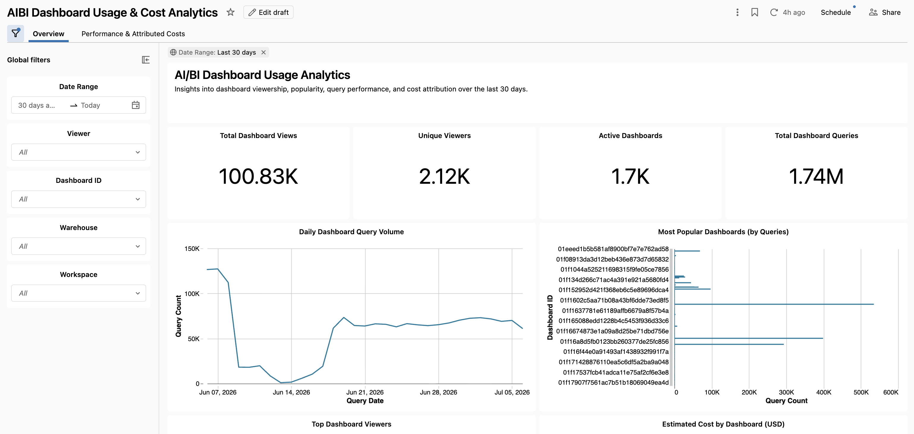

# Databricks Dashboard Usage & Cost Analytics

An importable **AI/BI dashboard** that turns Databricks **Unity Catalog system tables** into usage, performance, and cost analytics for every AI/BI dashboard in your account — so you can see which dashboards people actually use, who the power users are, how fast each one runs, and what it costs.

No pipelines, no jobs, no data copies. It reads live from system tables, so there's nothing to schedule and nothing to maintain.



---

## What it shows

**Overview** — the adoption view: total views, unique viewers, active dashboards, and total queries, plus daily query volume, most-used dashboards, top viewers, estimated cost by dashboard, and a query-level detail table.

**Performance & Costs** — the efficiency view: average query duration, cache hit rate, and total DBUs, plus cost and duration trends over time, cache hits vs. misses, and cost / DBU / duration broken out by user, SKU, and warehouse.

**Global Filters** — a shared control panel (date range, viewer, dashboard, warehouse) that lets you zoom from "the whole account, last 90 days" down to a single dashboard on a single warehouse without editing any SQL.

---

## How it works

The dashboard is powered by four datasets built directly on system tables:

| Signal | Source |
| --- | --- |
| **Views** | `system.access.audit` (`service_name = 'dashboards'`), joined to `system.access.workspaces_latest` for friendly workspace names |
| **Performance** | `system.query.history`, attributed to a dashboard via `query_source.dashboard_id` |
| **Cost** | `system.query.history` → `system.billing.attributed_usage` (joined on statement_id) → `system.billing.account_prices` for negotiated pricing, falling back to `system.billing.list_prices` for estimated USD |
| **Daily activity** | `system.query.history`, pre-aggregated by day / dashboard / warehouse for efficient trend lines |

---

## Prerequisites

1. **Unity Catalog** enabled on your workspace.
2. **System tables enabled** by an account admin — specifically the `access`, `query`, and `billing` schemas.
3. Whoever runs the dashboard needs **`SELECT` on those system schemas**.

> If you import the dashboard and every tile comes back empty or throws a permissions error, this is almost always the cause. Enabling system tables is a one-time, account-level action.

---

## Quick start

1. Download [`dashboards/dashboard_usage_cost_analytics.lvdash.json`](dashboards/).
2. In your Databricks workspace, go to **Dashboards → Create → Import dashboard from file** and select the `.lvdash.json`.
3. Assign a **SQL warehouse** to the dashboard.
4. On the **Global Filters** page, set a reasonable date range (30–90 days works well), pick a warehouse, and refresh.
5. Explore. Everything is editable — make it yours.

---

## Caveats — read before quoting any numbers

Treat this as a strong directional signal, not a billing-grade source of truth.

- **"Views" are an approximation.** A single dashboard open fires multiple audit events (an open event plus a widget-execution event per tile), so counts reflect *engagement*, not literal unique page loads. Narrow the tracked actions if you need stricter semantics.
- **Cost is a list-price estimate.** Dollars come from `account_prices` and do **not** reflect your negotiated/effective rate, discounts, or commits. Use them to compare dashboards against each other, not as a substitute for your invoice.
- **Cost attribution is cleanest on serverless SQL.** Statement-level DBU attribution lines up best with serverless SQL warehouses. On classic/pro warehouses (billed on uptime), per-dashboard cost can be partial or absent.
- **"Viewer" vs. "executing identity."** For *published* dashboards, queries run under the publisher's embedded credentials, not the viewer's identity — so the audit-based viewer metrics and the query-history cost metrics can describe different populations. Read the cost-by-user tiles as cost by *executing identity*.
- **Only AI/BI dashboards are tracked.** The join key is `query_source.dashboard_id`. Legacy/Redash dashboards use `legacy_dashboard_id` and won't appear.
- **Not real-time.** System tables have ingestion latency (hours; billing can lag longer). Expect "today" to look sparse and judge trends on settled data.
- **Finite retention.** The dashboard only sees what's still retained. Snapshot to your own table for longer-horizon analysis.
- **`system.query.history` is in Public Preview.** Its schema can evolve — watch the release notes.

---

## Roadmap

Ideas for future versions (contributions welcome):

- **Human-readable dashboard & warehouse names** via a scheduled Lakeview/Workspace API lookup table (no GA system table maps dashboard ID → name yet).
- **Zero-view / stale-dashboard detection** by left-joining a full dashboard inventory to activity — the tile that actually drives decommissioning.
- **Failure-rate widgets** using the `execution_status` already in the performance dataset.
- **Normalized efficiency metrics** (cost-per-query, cost-per-view) and a most-expensive-queries table.
- **Quantified cache savings**, a **time-of-day heatmap**, and a **data-scanned-by-dashboard** tile.
- **Materialized-view gold layer** for performance at scale, reusable by a Genie space.
- **Companion SQL alerts** on cost thresholds and failure spikes.

---

## Repo structure

```
databricks-dashboard-usage-analytics/
├── README.md
├── LICENSE
├── dashboards/
│   └── dashboard_usage_cost_analytics.lvdash.json
└── images/
    └── overview.png
```

---

## Contributing

Issues and PRs are welcome — especially new tiles, additional filters, or improvements to cost attribution. If you extend it, I'd love to hear what you added.

---

## License

Released under the [MIT License](LICENSE).

---

## Disclaimer

This is a personal project and is **not** an official Databricks product or offering, and is not endorsed by Databricks. All cost figures are **estimates derived from list prices** and should not be used for billing, chargeback of record, or financial reporting. Validate against your actual usage and invoices. Provided "as is," without warranty of any kind.
